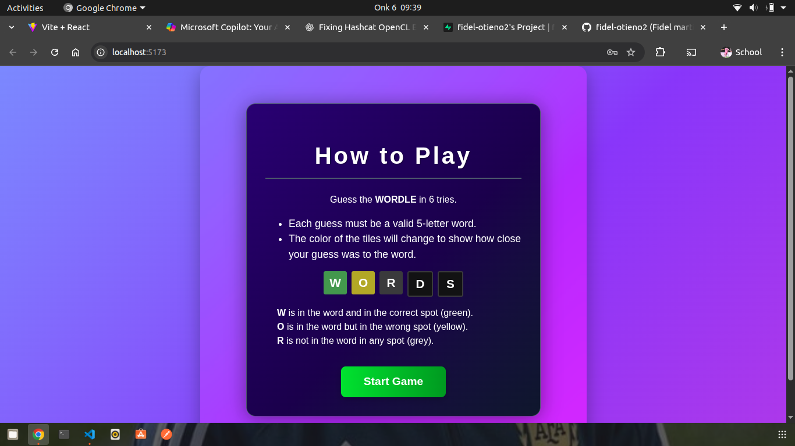
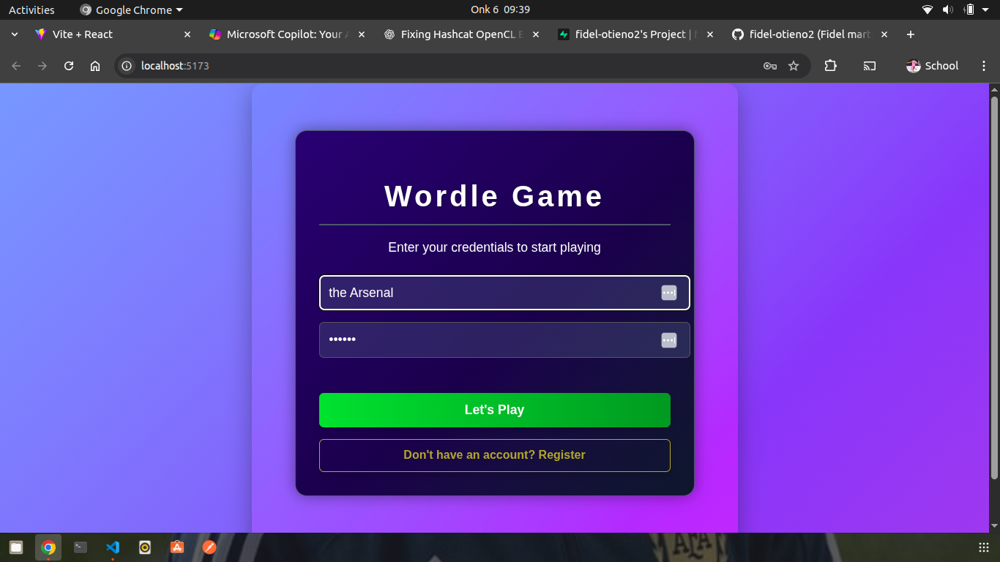

# Wordle Game Clone - Full Stack Edition 🎮

A full stack Wordle game clone built with **React** and **Vite** for the frontend, and **Flask** for the backend API. This project allows users to play a 5-letter word guessing game with authentication, game state persistence, and statistics tracking. Built with love and collaboration by a team of four students from Moringa School.

> **Team Members**: Fidel Martins, Jaylan Saad, Joy Hassan, Abdiaziz Ali, Beckam 
> **Institution**: Moringa School  
> **Project Type**: MVP (Minimum Viable Product)

---

## 📌 Table of Contents

- [🎯 Features](#-features)
- [📸 Screenshots](#-screenshots)
- [🧰 Technologies Used](#-technologies-used)
- [📦 Installation](#-installation)
- [🚀 Usage](#-usage)
- [🛠 Folder Structure](#-folder-structure)
- [🔧 Backend API](#-backend-api)
- [📚 How It Works](#-how-it-works)
- [💡 Future Improvements](#-future-improvements)
- [🧪 Testing](#-testing)
- [🤝 Contributing](#-contributing)
- [📄 License](#-license)
- [👨‍👩‍👧‍👦 Authors](#-authors)

---

## 🎯 Features

- Frontend:
  - React + Vite SPA with responsive design
  - 5-letter word guessing game with 6 attempts
  - Animated tiles and keyboard feedback
  - User authentication (login/register)
  - Real-time feedback on guesses
  - Color-coded hints (green, yellow, gray)
  - Mobile friendly UI

- Backend:
  - Flask REST API for authentication and game logic
  - User registration and login with JWT tokens
  - Daily word retrieval and guess validation
  - Game result submission and statistics tracking
  - posgreSQL database for persistence
  - Alembic migrations for database schema management

---

## 📸 Screenshots

> *Sample preview of the gameplay*




---

## 🧰 Technologies Used

- Frontend:
  - React 19
  - Vite 7
  - Axios for API calls
  - CSS Modules for styling

- Backend:
  - Python 3.8+
  - Flask
  - Flask-JWT-Extended for authentication
  - SQLAlchemy ORM
  - Alembic for migrations
  - posgreSQL database

---

## 📦 Installation

### Backend Setup

```bash
cd wordle-backend
python3 -m venv venv
source venv/bin/activate  # On Windows: venv\Scripts\activate
pip install -r requirements.txt
flask db upgrade  # Run database migrations
flask run  # Starts the backend server on port 5000
```

### Frontend Setup

```bash
cd wordle-clone
npm install
npm run dev  # Starts the frontend dev server on port 5173
```

---

## 🚀 Usage

- Open the frontend at `http://localhost:5173` (Vite default)
- Register a new account or login with existing credentials
- Guess the daily 5-letter word within 6 tries
- View your game statistics and history in the user dashboard

### Deployment

#### Frontend Deployment on Vercel

1. Push your code to GitHub
2. Connect your GitHub repo to Vercel
3. Set the build command to `npm run build`
4. Set the root directory to `wordle-clone`
5. Add environment variable: `VITE_API_URL=https://your-backend-url.com`
6. Deploy

#### Backend Deployment on Render

1. Push your backend code to a GitHub repository if not already done.
2. Go to https://render.com and sign up or log in.
3. Click "New" and select "Web Service".
4. Connect your GitHub repository containing the backend code.
5. Set the root directory to `wordle-backend`.
6. For the build command, use: `pip install -r requirements.txt`.
7. For the start command, use: `gunicorn app:app`.
8. Set environment variables in Render dashboard:
   - `DATABASE_URL` (your database connection string from Render's PostgreSQL database service - create a PostgreSQL database in Render first. If not set, it defaults to SQLite for testing)
   - `JWT_SECRET_KEY` (your JWT secret key - generate a secure random string)
   - `FLASK_ENV` (optional, set to `production` for production environment)
   - `PORT` (optional, Render usually sets this automatically, but you can specify if needed)
   - Any other environment variables your app requires (e.g., email service credentials, third-party API keys)
9. Click "Create Web Service" to start the deployment.
10. Render will build and deploy your backend, providing a public URL.

Once deployed, update your frontend's `VITE_API_URL` environment variable to point to the Render backend URL.

---

## 🛠 Folder Structure

```
/wordle-backend
├── app.py               # Flask app entrypoint
├── config.py            # Configuration settings (dev/prod)
├── models.py            # SQLAlchemy database models (User, Game)
├── routes/              # API route handlers
│   ├── __init__.py
│   ├── auth.py          # Authentication routes (login/register)
│   └── game.py          # Game logic routes (word, guess, result)
├── migrations/          # Alembic migration scripts
├── data/words.txt       # Word list for the game
├── requirements.txt     # Python dependencies
└── venv/                # Virtual environment (ignored)

/wordle-clone
├── src/
│   ├── components/      # React components
│   │   ├── WordleBoard.jsx  # Main game board
│   │   ├── Keyboard.jsx     # Virtual keyboard
│   │   ├── Tile.jsx         # Individual letter tiles
│   │   ├── Login.jsx        # Login form
│   │   ├── Register.jsx     # Registration form
│   │   └── Ending.jsx       # Game end screen
│   ├── services/        # API service modules
│   │   ├── api.js           # Main API client
│   │   └── auth.js          # Authentication helpers
│   ├── utils/           # Utility functions
│   │   └── wordleLogic.js   # Game logic helpers
│   ├── styles/          # CSS Modules for components
│   ├── App.jsx          # Main React app component
│   ├── main.jsx         # React app entrypoint
│   └── index.css        # Global styles
├── public/              # Static assets (favicon, etc.)
├── package.json         # Node dependencies and scripts
├── vite.config.js       # Vite configuration
└── README.md            # Frontend-specific docs
```

---

## 🔧 Backend API

The backend provides a RESTful API for the frontend to interact with.

### Authentication Endpoints
- `POST /auth/register` - Register a new user
  - Body: `{ "username": "string", "email": "string", "password": "string" }`
  - Returns: JWT token and user info
- `POST /auth/login` - Login existing user
  - Body: `{ "username": "string", "password": "string" }`
  - Returns: JWT token and user info

### Game Endpoints
- `GET /game/word` - Get the daily word (requires auth)
  - Returns: `{ "word": "masked_word", "wordId": "id" }`
- `POST /game/guess` - Validate a guess
  - Body: `{ "guess": "WORD", "wordId": "id" }`
  - Returns: Feedback array with colors
- `POST /game/result` - Submit game result
  - Body: `{ "wordId": "id", "won": true, "attempts": 3 }`
  - Updates user statistics

### Statistics Endpoints
- `GET /stats` - Get user game statistics
  - Returns: Games played, won, win rate, etc.

All endpoints except auth require JWT token in Authorization header.

---

## 📚 How It Works

### Frontend Flow
1. User logs in/registers, JWT token stored in localStorage
2. App fetches daily word from backend
3. User inputs guesses via keyboard or virtual keyboard
4. Each guess sent to backend for validation
5. Feedback displayed with color-coded tiles
6. Game ends after 6 attempts or correct guess
7. Result submitted to backend for stats tracking

### Backend Flow
1. User authentication with JWT tokens
2. Daily word selected from word list (same for all users)
3. Guess validation against word list and game rules
4. Game results stored in database with user association
5. Statistics calculated from user's game history

### Database Schema
- Users table: id, username, email, password_hash, created_at
- Games table: id, user_id, word, won, attempts, played_at

---

## 💡 Future Improvements

- Add dark/light mode toggle
- Implement hard mode and difficulty levels
- Add live word validation via external API
- Enable sharing scores on social media
- Add sound and vibration feedback on mobile
- Improve accessibility and localization support
- Add multiplayer mode
- Implement leaderboards
- Add email verification for registration

---

## 🧪 Testing

- Frontend uses React Testing Library for unit tests.
- Backend tests cover API endpoints and database models.
- Run frontend tests with `npm run test`.
- Backend tests can be run with pytest in the backend environment.

---

## 🤝 Contributing

Contributions are welcome! Please open issues or pull requests for bug fixes and features.

1. Fork the repository
2. Create a feature branch
3. Make your changes
4. Add tests if applicable
5. Submit a pull request

---

## 📄 License

MIT License © 2025 Fidel Martins and Team
Feel free to use, modify, and share — with credit.

---

## 👨‍👩‍👧‍👦 Authors

Fidel Martins - UI/UX & Project Lead

Hassan - Game Logic & Input Handling

Abdiazi - Word List Design & Testing

Ben - Styling, Animations, and CSS polish

✨ This project was built with dedication, learning, and collaboration at Moringa School. Thank you for checking it out!

